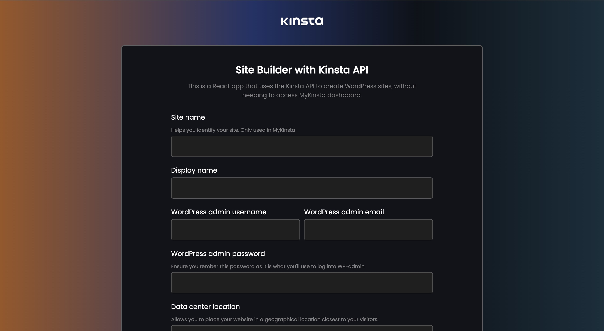

# How To Create a WordPress Site With Kinsta API

Learn how to use the Kinsta API to make HTTP requests using the Fetch API in a React application.

Read the [full article](https://kinsta.com/blog/wordpress-api/).

## Installation
1. Clone or fork the repository.

## Kinsta Application Hosting Setup
### Dependency Management

Kinsta automatically installs dependencies defined in your `package.json` file during the deployment process.

### Port

Kinsta automatically sets the `PORT` environment variable. You should **not** define it yourself and you should **not** hard-code it into the application.

### Start Command

When deploying an application, Kinsta automatically creates a web process based on the `npm start` in the `package.json` as the entry point.

### Deployment Lifecycle

Whenever a deployment is initiated (through creating an application or re-deploying due to an incoming commit) the `npm install` and `npm build` commands are run.

## What is Kinsta
Kinsta is a developer-centric cloud host / PaaS. We’re striving to make it easier for you to share your web projects with your users. Focus on coding and building, and we’ll take care of deployment and provide fast, scalable hosting. + 24/7 expert-only support.

- [Start your free trial](https://kinsta.com/signup/?product_type=app-db)
- [Application Hosting](https://kinsta.com/application-hosting)
- [Database Hosting](https://kinsta.com/database-hosting)